# 🎮 Steam Games Analytics Dashboard

## 📖 Project Description
This project scrapes and analyzes **Steam store game data** to uncover trends in genres, pricing, reviews, and release history.  
The workflow includes:
- **Test scraping (50 rows)** → validate expected columns.  
- **Page scraping (3 games)** → confirm full-page parsing.  
- **Bulk scraping (1k rows)** → build initial dashboard.  
- **Sample dataset (200 rows)** → quick iteration and testing.  
- **Full scraping (10k rows)** → production dataset for final dashboard.  
- **Cleaning + EDA** → robust pipelines for type conversion, missing values, and exploratory plots.  
- **Streamlit dashboard** → interactive analytics with Plotly charts.

---

## 📸 Project Workflow Images

### Test Notebook (50 rows)
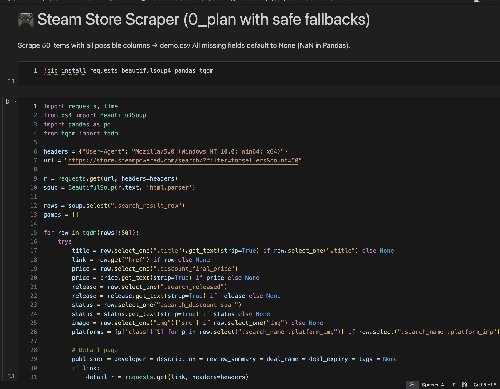


### Page Scrape (3 games)
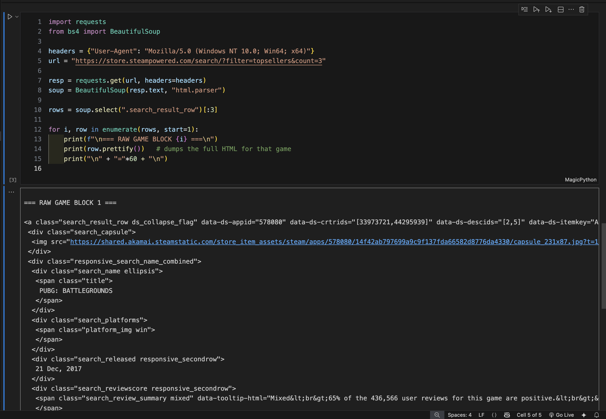

### Bulk Scrape (1k rows)
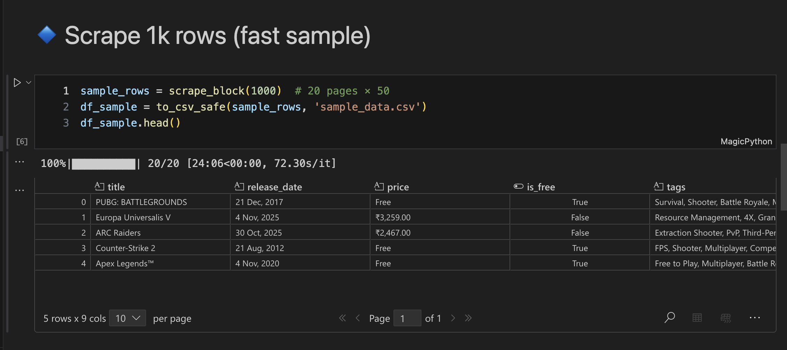

### Sample Dataset (200 rows)
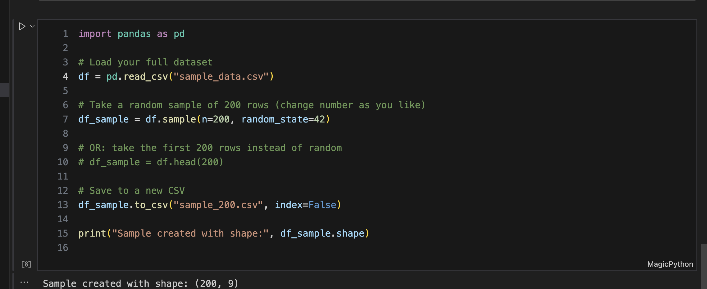

### Raw Scrape (10k rows)
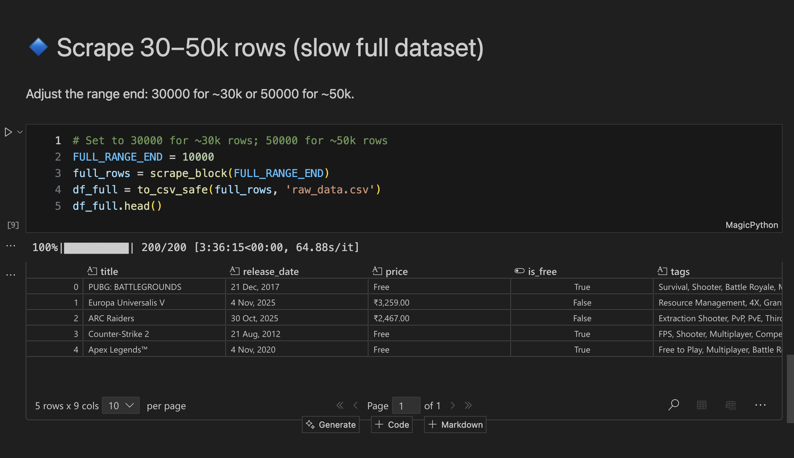

### Cleaning Notebook
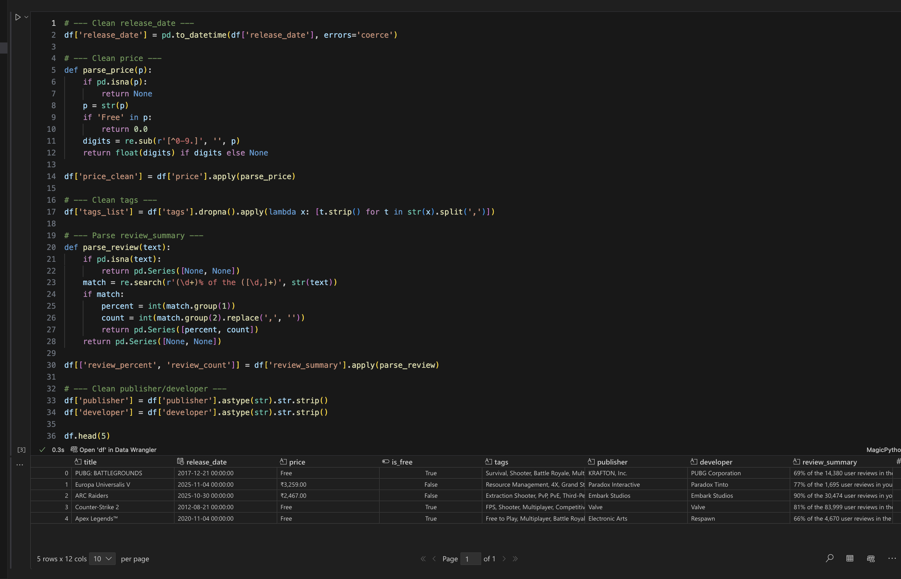

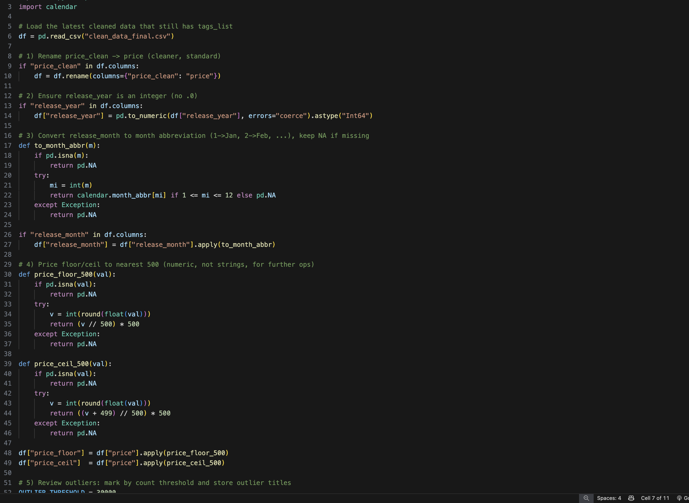

### EDA Notebook
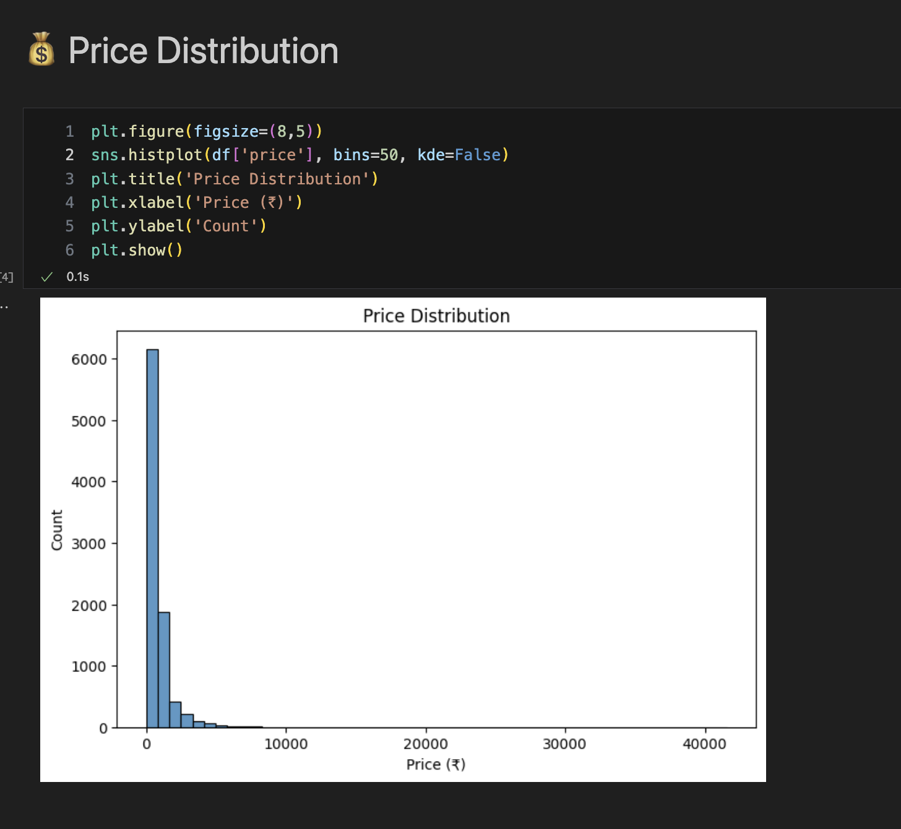
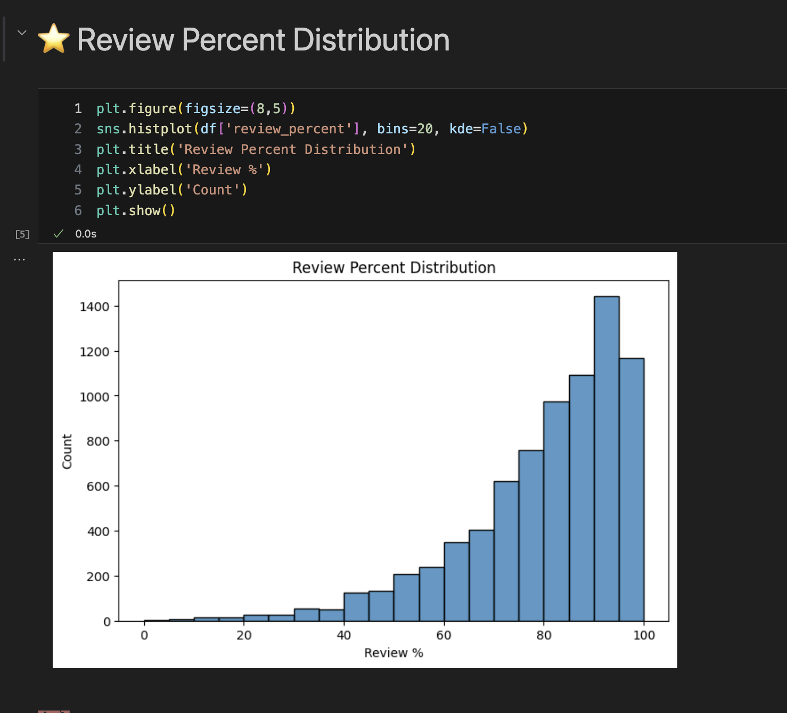
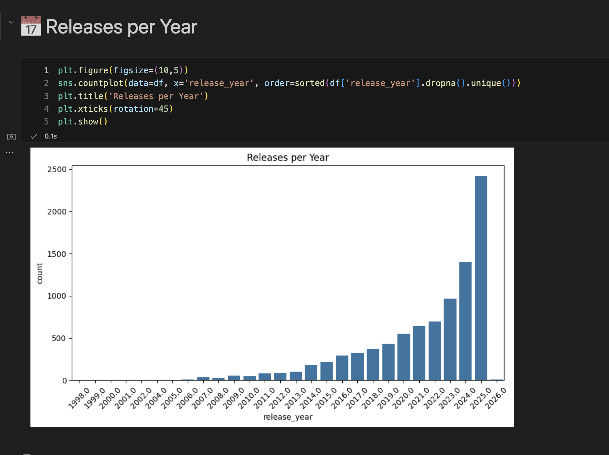


### Final Dashboard
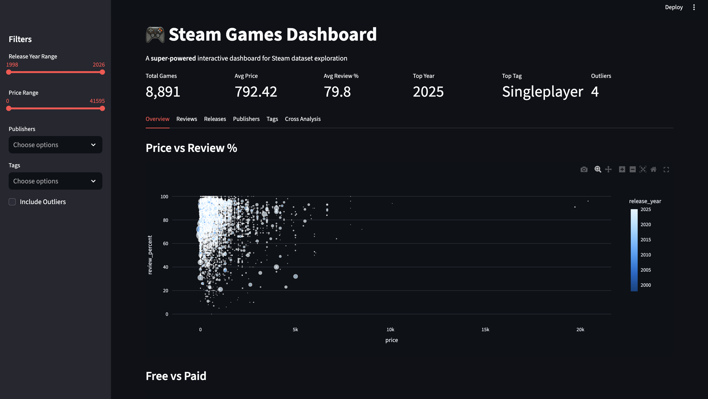
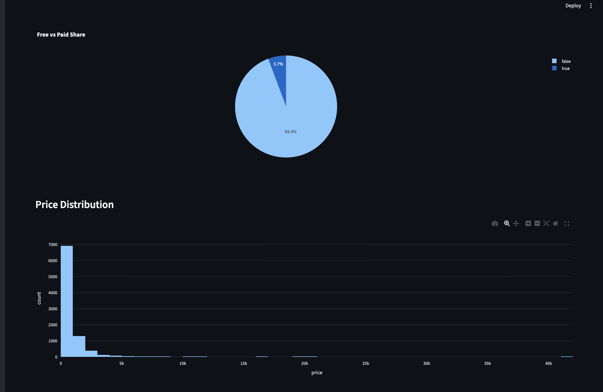
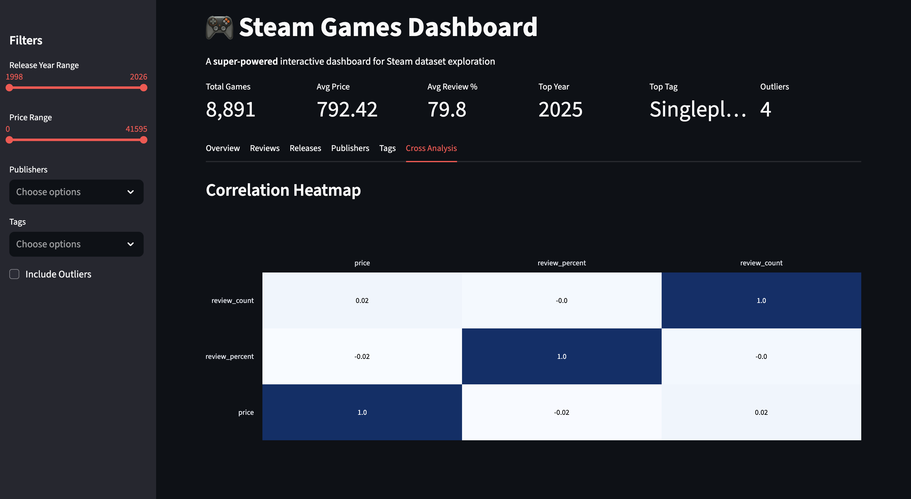


*(Replace these placeholders with actual screenshots saved in `assets/`.)*

---

## ✨ Features
- **Scraping pipeline**: BeautifulSoup/Requests to extract Steam game metadata.  
- **Data cleaning**: Normalize column names, convert numeric fields, handle missing values.  
- **Exploratory Data Analysis (EDA)**: distributions, correlations, trends.  
- **Interactive dashboard**: KPIs, genre analysis, yearly trends, scatter plots, correlation heatmap.  
- **Export options**: filtered dataset as CSV.  

---

## ⚙️ Setup Instructions

### Step‑by‑Step
```bash
# 1. Clone the repository
git clone https://github.com/your-username/steam-analysis.git
cd steam-analysis

# 2. Create a virtual environment
python -m venv venv

# 3. Activate the environment
# On macOS/Linux
source venv/bin/activate
# On Windows
venv\Scripts\activate

# 4. Install dependencies
pip install -r requirements.txt

# 5. Run the dashboard
streamlit run dashboard.py
# steam-analysis
# steam-analysis
